# Windows Server 2022 Active Directory & Endpoint Hardening Lab

## Project Overview
This project is a hands-on technical lab where I built a secure, isolated corporate network domain from scratch using Oracle VirtualBox. The main goal was to implement a practical "Zero Trust" and "Least Privilege" environment for a multi-department company, and then audit how effectively the security controls held up. 

I configured network infrastructure, managed user account lifecycles (Joiner, Mover, Leaver), established strict folder permissions, and deployed Group Policies (GPOs) to protect endpoints from insider threats and malware. Finally, I mapped these technical implementations back to real-world corporate governance frameworks like ISO/IEC 27001 and the Digital Personal Data Protection (DPDP) Act.

---

## 🏗️ 1. Infrastructure Setup & Network Blueprint
To make sure testing wouldn't impact any live systems, I built everything inside an isolated virtual network (`intnet`) with zero internet access.

* **Domain Controller:** Windows Server 2022 (Standard Evaluation)
* **Domain Name:** `corp.local`
* **Static IP Layout:** * Server / DNS: `192.168.1.6`
  * Workstation: `192.168.1.50`
* **Client Machine:** Windows 10 Enterprise, fully bound to the `corp.local` domain.

### VirtualBox Network Isolation Configuration
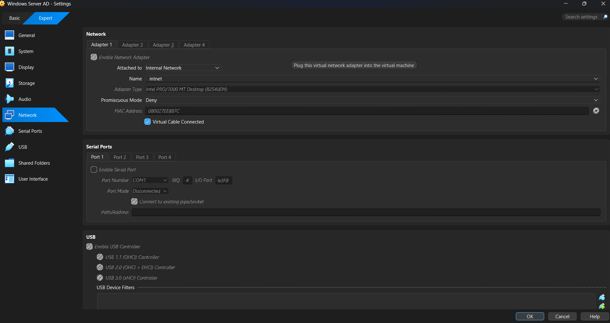

### Domain Controller Static IP Setup
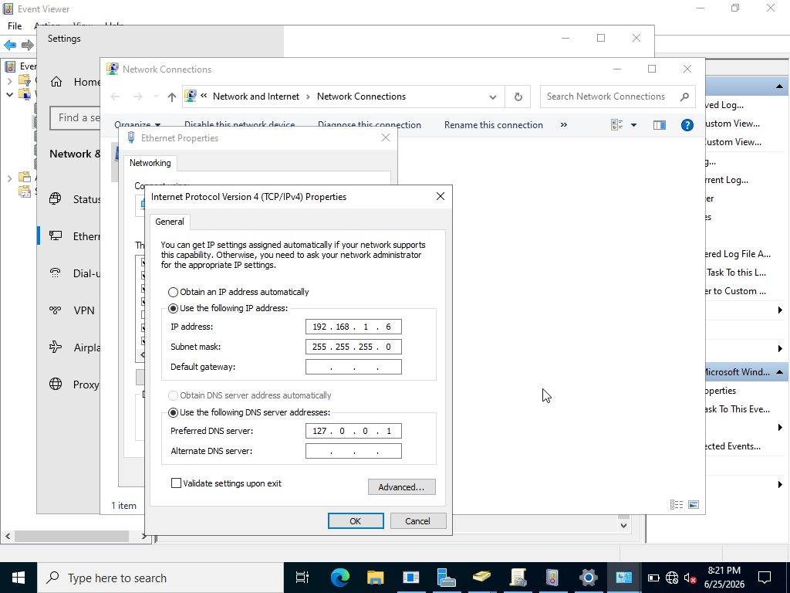

### Client Workstation Domain Join
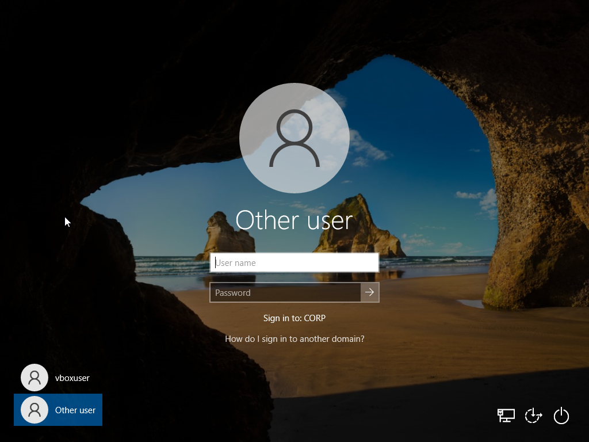

---

## 👥 2. Organizational Structure & Access Control (RBAC)
Instead of assigning access rights to individual employees, I set up Role-Based Access Control (RBAC) to mimic a real business environment. 

### Active Directory Design
I created a parent Organizational Unit (OU) called `Corp_Objects` and broke it down into standard departmental OUs:
* `\IT-Staff` (Users: Ronaldo, Jota, Modric)
* `\Finance-Staff` (Users: Messi, Reus, Ibrahimovic)
* `\HR-Staff` (Users: Neymar, Santos, Haaland, Mbappe)
* `\Disabled Users` (Quarantine folder for terminated staff)

### Active Directory Organizational Unit Structure
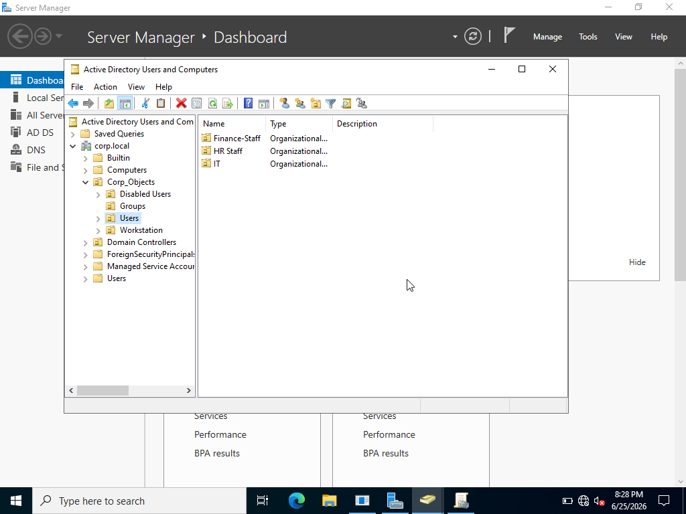

### Storage Security & Hardening Folder Permissions
I set up dedicated corporate folders on the server's drive (`C:\Corporate_Shares\Finance_Share`, `HR_Share`, `IT_Share`). To make sure users couldn't peek into other departments' data, I performed the following:
1. **Broke NTFS Inheritance:** Stopped the subfolders from inheriting broad default permissions from the C: drive.
2. **Purged Broad Access:** Completely removed standard groups like "Everyone" and "Authenticated Users" from the Access Control List (ACL).
3. **Linked Specific Security Groups:** Created Global Security Groups (e.g., `SG_Finance_Dept`) and assigned them explicit **Modify/Write** access to their own folder only.

### Disabling NTFS Permission Inheritance
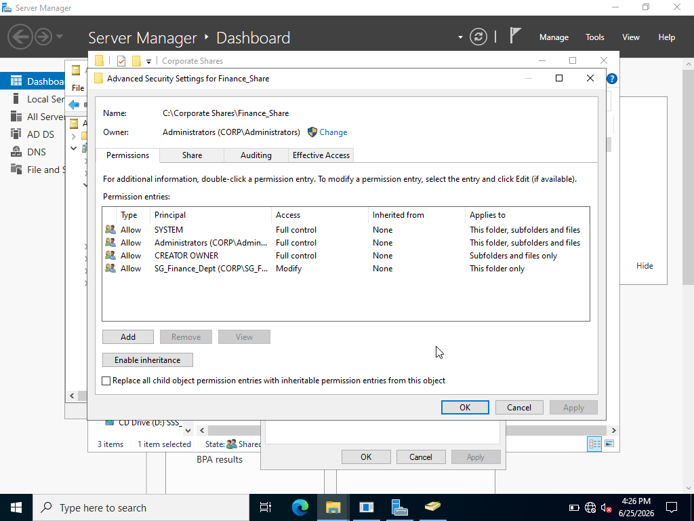

### Role-Based Access Control (RBAC) Security Group Mappings
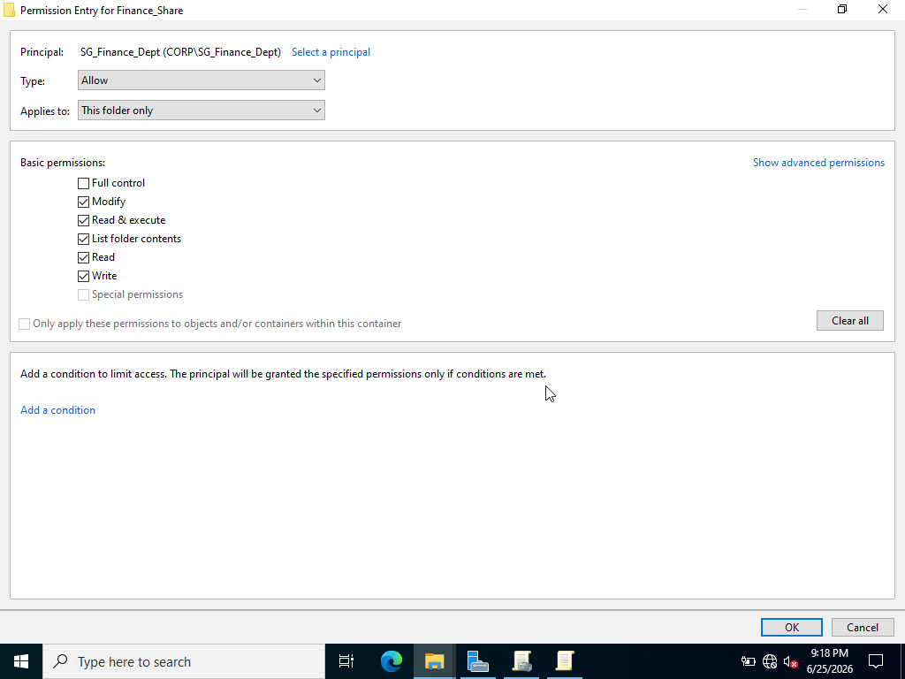

---

## 🔄 3. Identity Lifecycle Management (JML Playbook Validation)
To test the security layout against everyday business changes, I simulated the three phases of the identity lifecycle:

### The Joiner (Onboarding)
* **Action:** Provisioned a new employee account and added them to their specific departmental group. 
* **Audit Check:** Logged into the Windows 10 workstation as the new user. They could easily access their own shared folder but received a hard **"Access is Denied" network error** when trying to open a different department's share.

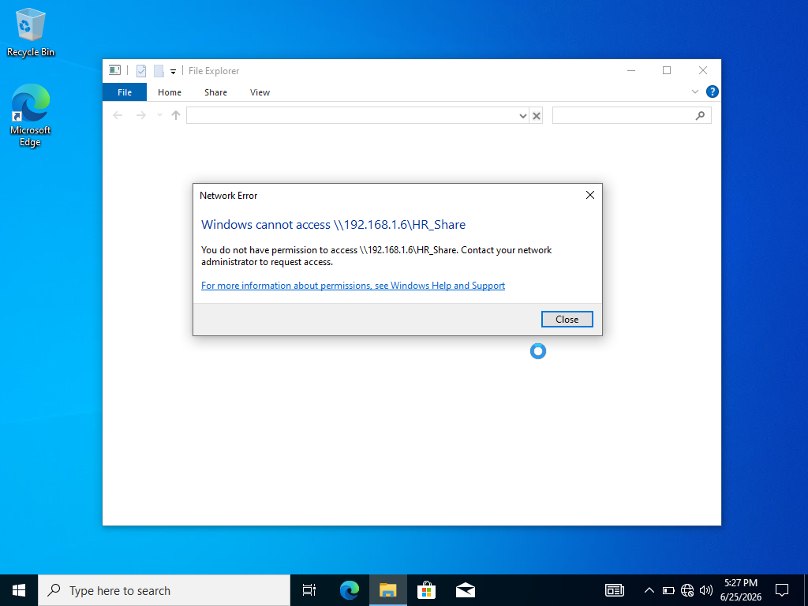

### The Mover (Internal Department Transfer)
* **Action:** Simulated an employee moving from Finance to HR.
* **Audit Check:** Shifted their user account to the `HR-Staff` OU and updated their group membership (removed from Finance group, added to HR group). Verified on the client machine that their old Finance share access was immediately revoked, preventing **privilege creep**.

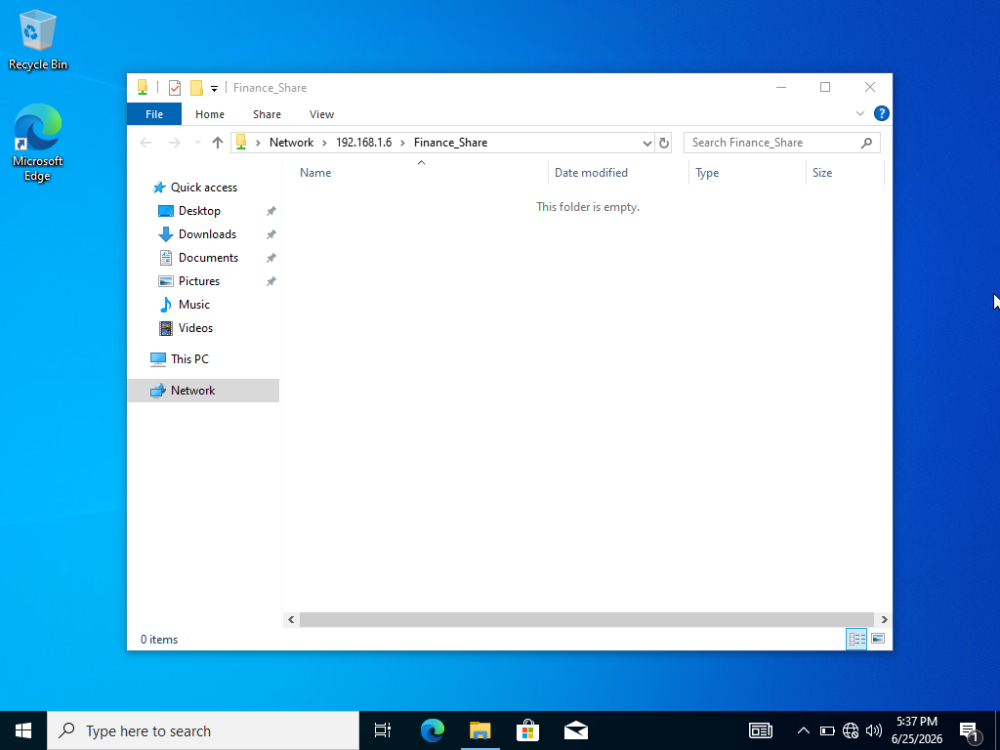

### The Leaver (Termination / Offboarding)
* **Action:** Handled an emergency employee termination.
* **Audit Check:** Disabled the account, stripped all group memberships to wipe out their access tokens entirely, and moved the account object to the `Disabled Users` OU. Verified that trying to log onto the client machine with that profile resulted in an immediate **"Your account has been disabled" login rejection**.

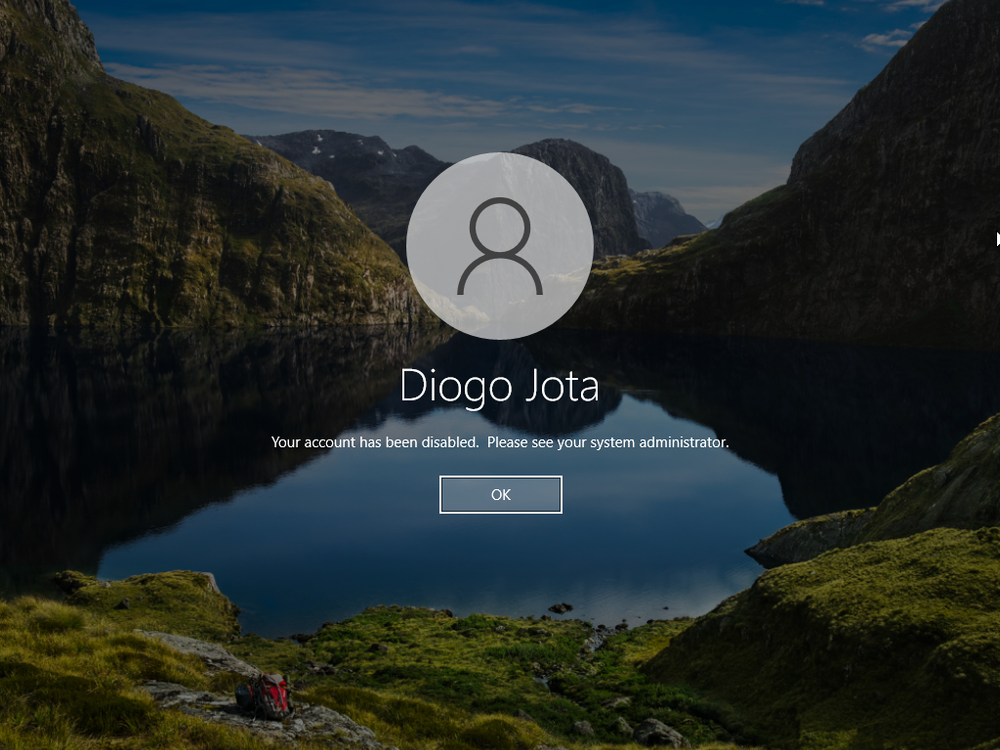

---

## 🛡️ 4. Endpoint Hardening & Group Policy Enforcement
I built and linked targeted Group Policy Objects (GPOs) to control what standard users could do on the network's workstations.

### Attack Surface Reduction (Command Prompt Ban)
* **Policy:** `GPO_Standard_User_Restrictions`
* **Configuration:** Enforced "Prevent access to the command prompt" for the HR and Finance OUs. I explicitly set "Disable the command prompt script processing also" to **No**.
* **Result:** This blocks the human user from executing manual terminal commands, but safely allows standard corporate logon scripts to run in the background.

### Environmental Enhancements
* **Legal Banner:** Set up an interactive logon GPO that forces a strict corporate legal warning notice to appear before anyone can type their credentials.
* **Privacy Hardening:** Configured local security settings to hide cached usernames from the logon screen, forcing users to type both their username and password manually to prevent shoulder-surfing.

### Interactive Logon Legal Banner
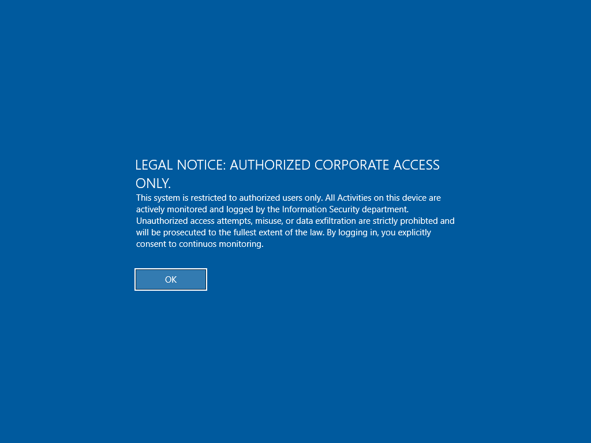

---

## 🚨 5. Security Logging & Auditing (SIEM Log Generation)
To prove to an auditor that we can actively trace unauthorized activity, I turned on advanced logging:

1. Enabled **Audit File System** (Success and Failure events) inside the Advanced Audit Policy Configuration.
2. Turned on auditing for **Everyone** inside the advanced properties of the `Finance_Share` folder.
3. **The Test:** Attempted to force-open the Finance folder using an unauthorized IT account. 
4. **The Log Evidence:** Checked the Server's **Event Viewer (Security Log)** and caught the exact event logging the unauthorized attempt, matching the user's account name directly to the blocked folder path.

### Advanced Audit Policy Configuration
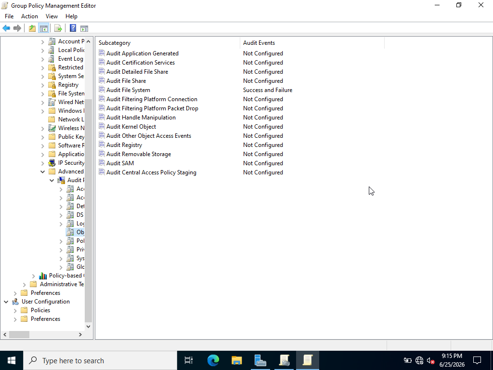

### Windows Event Viewer Security Audit Log
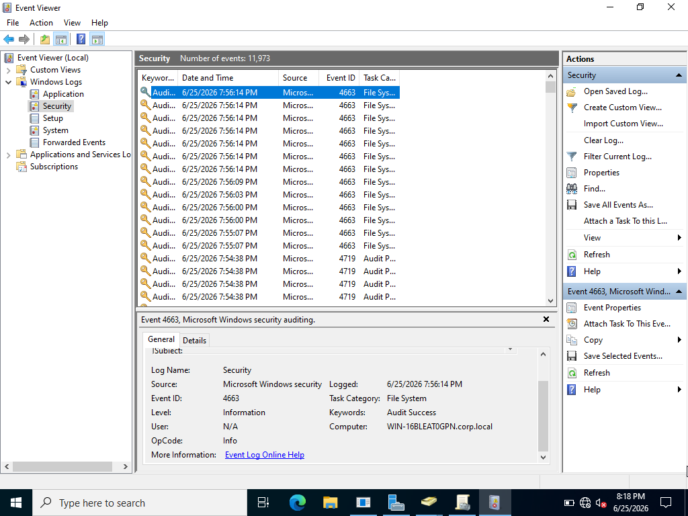

---

## 📊 6. Governance & Compliance Framework Mapping
This lab demonstrates technical enforcement of key controls found in major compliance audits:

| Technical Control Built | ISO/IEC 27001:2022 Control Link | Regulatory Target (e.g., DPDP Act 2023) | Governance Purpose |
| :--- | :--- | :--- | :--- |
| **Broke NTFS Inheritance & Segregated Folders** | **A.9.1** (Access Control Policy) & **A.8.12** (Data Classification) | Internal Security Standard | Enforces explicit logical boundaries and Segregation of Duties (SoD). |
| **Interactive Logon Warning Banner** | **A.5.15** (Access Control) & **A.7.2** (Security Awareness) | Corporate Policy Baseline | Formally establishes system monitoring ownership before a user accesses the network. |
| **Account Lockout Policy Baseline** | **A.9.4** (System Access Control) | Defense-in-Depth | Mitigates brute-force scripts and automated password guessing. |
| **USB Read/Write Restrictions GPO** | **A.8.23** (Digital Asset Rights) & **A.8.14** (Media Handling) | **DPDP Act (Section 8: Security Safeguards)** | Implements physical/logical safeguards to prevent unauthorized data leaks. |
| **Disabled Command Prompt (cmd.exe)** | **A.12.1** (Operational Procedures & Utilities Restrictions) | Endpoint Hardening | Limits standard user capability to modify system files or run local scripts. |
